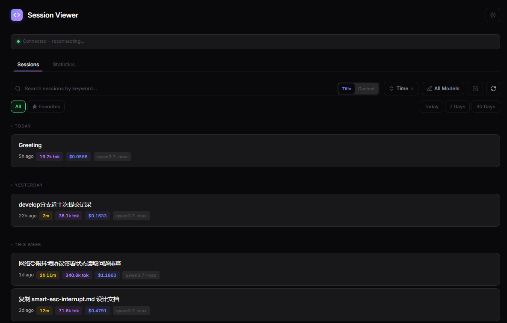
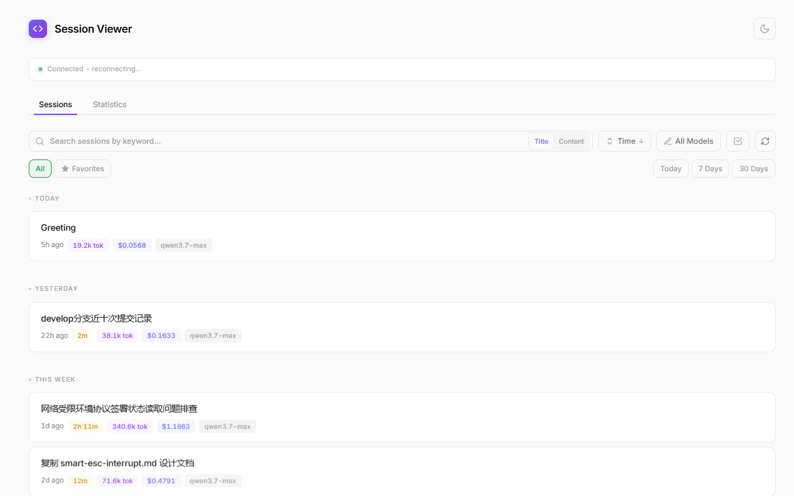
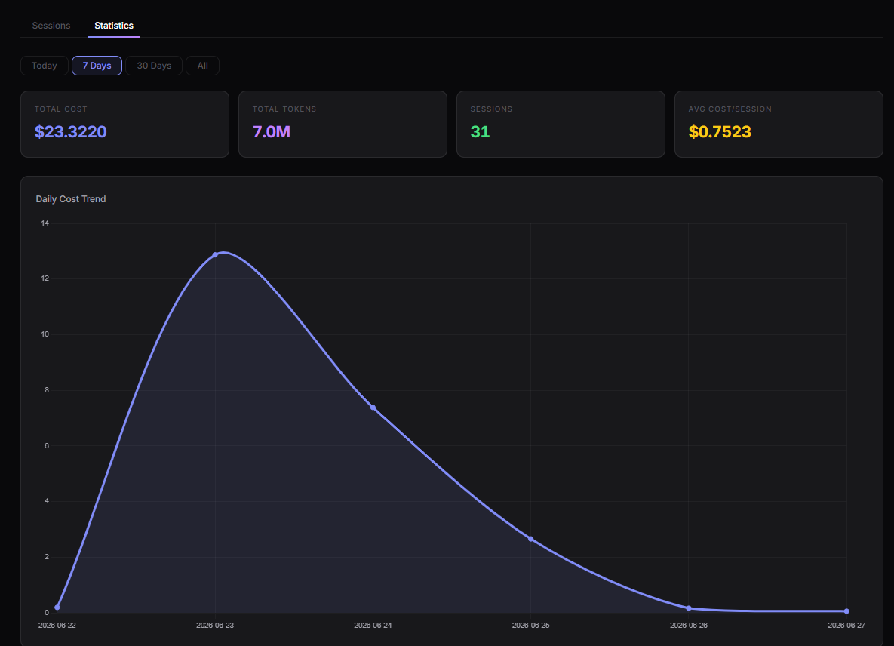

# DevEco Code Session Viewer

English | [中文](./README.zh-CN.md)

A plugin for deveco/opencode that provides a local web UI to browse, search, and manage conversation sessions with theme switching and keyboard navigation support.

## Screenshots

<p align="center">
  
  
</p>
<p align="center">
  
</p>

## Features

### Session Management
- **Session List View** - Browse all conversation sessions with search, sort, and filter
- **Session Detail View** - View complete conversation history with markdown rendering
- **Rename Sessions** - Edit session titles directly from the list (syncs with deveco TUI)
- **Delete Sessions** - Permanently remove sessions with confirmation dialog
- **Bulk Operations** - Multi-select sessions for batch delete or export (JSON format)
- **Favorites** - Star sessions to pin them to the top of the list (stored in browser localStorage)
- **Export** - Export conversations as Markdown or JSON, content respects Clean Mode setting
- **Copy Messages** - Copy individual message content to clipboard
- **Message Count & Duration** - Session cards display conversation turn count and duration

### Search & Filter
- **Title Search** - Filter sessions by title keyword (server-side, fast)
- **Full-text Search** - Search all session message content with highlighted match snippets (client-side, cached, batch-loaded)
- **In-conversation Search** - Ctrl+F to search within a conversation with match highlighting and navigation
- **Sort** - Sort sessions by Time, Cost, or Tokens (ascending/descending)
- **Model Filter** - Multi-select checkbox filter to show sessions by specific models
- **Favorites Filter** - Toggle to show only favorited sessions
- **Time Filter** - Quick filter by Today, 7 Days, or 30 Days
- **Time Grouping** - Sessions grouped by Today / Yesterday / This Week / This Month / Older when sorted by time
- **Pagination** - Loads 50 sessions initially, auto-loads more on scroll to prevent rendering lag

### Statistics Dashboard
- **Tab-based Navigation** - Switch between Sessions and Statistics views
- **Time Range Selector** - Filter stats by Today, 7 Days, 30 Days, or All time
- **Summary Cards** - Total Cost, Total Tokens, Session Count, Average Cost per Session
- **Charts** (powered by Chart.js):
  - Daily Cost Trend (line chart)
  - Daily Token Trend (line chart)
  - Cost by Model (doughnut chart)
  - Daily Sessions (bar chart)

### UX
- **Modern Minimalist UI** - Refined color palette, Inter + JetBrains Mono fonts, unified SVG icons, smooth transitions
- **Real-time Updates** - Automatic refresh via Server-Sent Events (SSE) when sessions or messages change
- **Clean Mode** - Hide intermediate agent steps, show only user inputs and final assistant responses per turn
- **Sticky Header** - Session title, search bar, and navigation controls stay visible while scrolling
- **Server Info** - Status bar shows connected project directory and server IP:port
- **Theme Switching** - Toggle between dark and light themes (preference saved to localStorage)
- **Keyboard Navigation** - Navigate sessions with arrow keys, Enter to open, Esc to go back
- **Shortcuts Panel** - Press `?` to view all keyboard shortcuts

## Installation

### 1. Clone the repository

```bash
git clone https://github.com/AgentGear/deveco-session-viewer.git
cd deveco-session-viewer
```

### 2. Install dependencies

```bash
npm install
```

### 3. Configure in your deveco project

Add the plugin to your `deveco.jsonc` (or `opencode.jsonc`):

```jsonc
{
  "plugin": [
    ["./path/to/deveco-session-viewer", { "port": 9876 }]
  ]
}
```

**Options:**
- `port` (optional): HTTP server port, defaults to `9876`

### 4. Start deveco

```bash
bun dev
```

### 5. Open the web UI

Visit `http://localhost:9876` in your browser.

## Requirements

- **deveco**: >= 1.15.0 (or any compatible fork)
- **Node.js**: >= 18

## Usage

### Session List

- Browse all sessions with time grouping (Today / Yesterday / This Week / This Month / Older)
- Use the search box to filter sessions by keyword
- Use the sort dropdown to sort by Time, Cost, or Tokens (click again to toggle direction)
- Use the model filter dropdown to show only sessions using specific models (multi-select)
- Click the star icon on any session card to favorite it (favorited sessions are pinned to top)
- Click the pencil icon to rename a session
- Click the trash icon to delete a session (with confirmation)
- Click any session card to view details

### Session Detail

- **Search** - Always-visible search bar to find text within the conversation (Enter/Shift+Enter to navigate matches)
- **Export** - Export the conversation as Markdown or JSON (respects Clean Mode)
- **Clean Mode** - Hide intermediate agent steps, show only user inputs and final assistant response per turn
- **Copy** - Hover over any message to copy its text content
- **Back** button - Return to session list
- Session metadata: title, creation time, last updated time, model, token usage, cost

### Statistics

- Switch to the Statistics tab to view usage analytics
- Select time range: Today, 7 Days, 30 Days, or All
- View summary cards and interactive charts

### Real-time Updates

The web UI automatically updates when:
- New sessions are created
- Session titles change
- Sessions are deleted
- New messages are added to the currently viewed session

Updates are delivered via Server-Sent Events (SSE) with automatic reconnection on disconnect.

### Keyboard Shortcuts

Press `?` anytime to view the shortcuts panel.

**Session List:**
- `↑` / `↓` - Navigate between sessions
- `Enter` - Open selected session
- `Esc` - Clear search (if search box is focused)
- `?` - Show shortcuts panel

**Session Detail:**
- `Ctrl+F` / `Cmd+F` - Search within conversation
- `Enter` - Next search match
- `Shift+Enter` - Previous search match
- `Esc` - Close search / Return to session list

**General:**
- Click theme toggle button in header to switch between light and dark themes

## Architecture

This plugin is **zero-dependency** at runtime:

- Uses Node.js built-in `node:http` and `node:os` modules
- Embeds the complete web UI as a string (no static files)
- Communicates with deveco via in-process client (no network overhead)
- Type definitions are inlined (no external `@opencode-ai/plugin` dependency)
- Chart.js loaded via CDN for statistics charts
- Theme preference and favorites stored in browser localStorage

The plugin starts an HTTP server that:
1. Serves the embedded web UI at `/`
2. Provides REST API endpoints for session data
3. Streams real-time events via SSE at `/api/events`

## API Endpoints

| Endpoint | Method | Description |
|---|---|---|
| `/` | GET | Web UI |
| `/api/info` | GET | Project info (directory, projectId, serverIP, serverPort) |
| `/api/sessions?search=...&limit=...` | GET | List sessions with optional search and limit |
| `/api/sessions/:id` | GET | Get session details |
| `/api/sessions/:id` | PATCH | Update session (title) |
| `/api/sessions/:id` | DELETE | Delete a session |
| `/api/sessions/:id/messages?limit=...` | GET | Get session messages |
| `/api/events` | GET | SSE stream for real-time updates |

## Changelog

See [CHANGELOG.md](./CHANGELOG.md) for release history.

## License

MIT License - see [LICENSE](./LICENSE)

Based on [opencode](https://github.com/sst/opencode) by SST.
